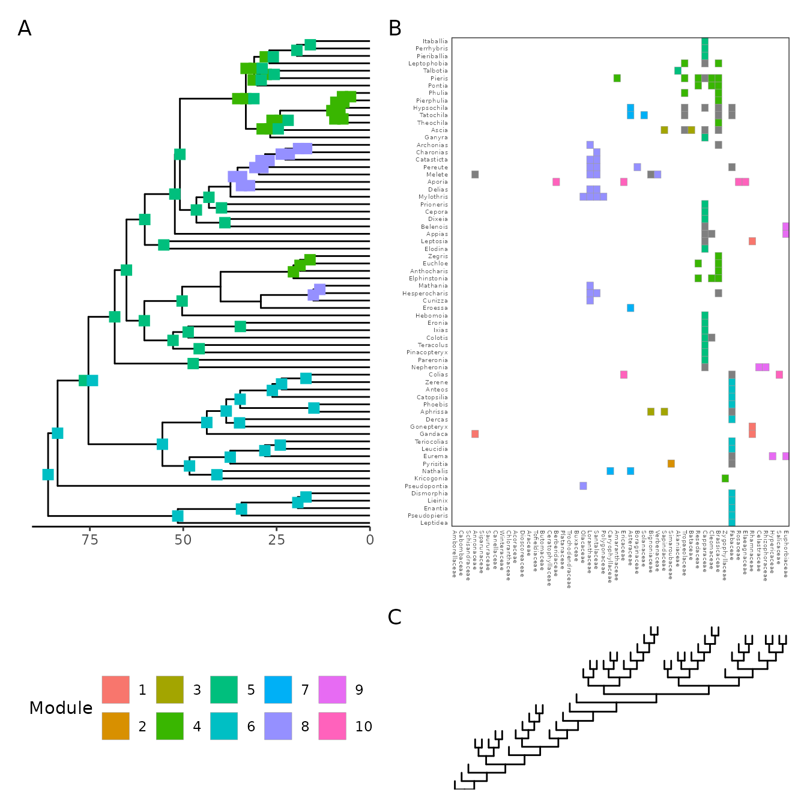

# Quick package overview

`evolnets` is an R package for summarizing the posterior distribution
produced by Bayesian inference of ancestral networks. Currently, the
only available approach specific for inference of ecological
interactions is based on the model of host-repertoire evolution
implemented originally in
[RevBayes](https://revbayes.github.io/tutorials/host_rep/host_rep.html)
and then in [TreePPL](https://treeppl.org). If you are unfamiliar with
this model, check out this [paper in Systematic
Biology](https://doi.org/10.1093/sysbio/syaa019) where the model is
introduced.

Even though the approach used here can be applied to a variety of
biological systems, it was developed with host-symbiont interactions in
mind, so I’ll be using the words *host* and *symbiont*. They could, in
principle, be replaced by terms like *host* and *parasite*, *resource*
and *consumer*, *lower trophic level* and *higher trophic level*, or any
other two groups of nodes that form a bipartite network.

Examples of biological systems studied in papers that have used the host
repertoire model and `evolnets` include:
[plant-butterfly](https://onlinelibrary.wiley.com/doi/full/10.1111/ele.13842),
[beetle-microbiota](https://link.springer.com/article/10.1007/s00248-023-02251-5),
mimicry in
[butterflies](https://www.journals.uchicago.edu/doi/abs/10.1086/735835?journalCode=an)
and
[beetles](https://www.sciencedirect.com/science/article/pii/S0960982224013526).

## Set up

If you haven’t installed `evolnets` yet, do so first:

``` r
devtools::install_github("maribraga/evolnets")
```

We will need a few packages:

``` r
library(evolnets)
library(ape)
library(dplyr)
library(ggplot2)
```

and four pieces of data:

- Time-calibrated phylogenetic tree of the symbiont clade
- Phylogenetic tree of the host clade
- `history.txt` output from RevBayes, which contains the sampled
  histories of host-repertoire evolution during MCMC
- Matrix of extant interactions for plotting

`evolnets` includes example data which we’ll use in this vignette. But
when you use your own data, simply replace the
[`system.file()`](https://rdrr.io/r/base/system.file.html) call with the
path for your files.

Your phylogenetic trees need to be `phylo` objects, and many tree files
can be read into R using the `ape` or `treeio` packages. One important
step when reading in the symbiont tree is to retrieve node labels from
RevBayes. R and RevBayes label the internal nodes of a tree in different
ways, so it’s important to export the symbiont tree from RevBayes to be
able to use them in R (using the
[`write()`](https://rdrr.io/r/base/write.html) function in RevBayes).
Here’s how you do it:

``` r
# read the symbiont tree exported from RevBayes 
tree <- read_tree_from_revbayes(system.file("extdata", "tree_pieridae.tre", package = "evolnets"))

# we don't need node labels for the host tree, so you can read it using ape::read.tree()
host_tree <- ape::read.tree(system.file("extdata", "host_tree_pieridae.phy", package = "evolnets"))
```

The evolnets function `read_history` is designed specifically to read
.txt files produced by RevBayes. As more inference methods become
available, we will expand the scope of this function.

``` r
history <- read_history(system.file("extdata", "history_thin_pieridae.txt", package = "evolnets"))
```

Lastly, we need a matrix of extant interations.

``` r
matrix <- read.csv(
  system.file("extdata", "interaction_matrix_pieridae.csv", package = "evolnets"),
  row.names = 1) |> 
  as.matrix()
```

As I said before, in this vignette we’ll use data that comes with
evolnets. This data comes from a
[paper](https://onlinelibrary.wiley.com/doi/10.1111/ele.13842) where we
studied the evolution of interactions between Pieridae butterflies and
their Angiosperm host plants. The results are not identical to the ones
in the paper because we will use a subset of the MCMC samples in this
example in order to reduce file size and speed up the analysis.

Now we can start extracting information from the inferred history.

## Rate of evolution

Let’s calculate the average number of events (host gains and host
losses) across MCMC samples. Of those, how many are gains and how many
are losses?

``` r
(n_events <- count_events(history))
#>       mean HPD95.lower HPD95.upper
#> 1 148.4752         121         178
(gl_events <- count_gl(history))
#>    gains   losses 
#> 75.60396 72.87129
```

We estimated that, on average, 148.5 events happened across the
diversification of Pieridae, being 75.6039604 host gains and 72.8712871
host losses. Similarly, we can calculate the rate of host-repertoire
evolution across the branches of the symbiont tree, which is the number
of events divided by the sum of branch lengths of the symbiont tree.

``` r
(rate <- effective_rate(history,tree))
#>         mean HPD95.lower HPD95.upper
#> 1 0.06170151  0.05028369  0.07397104
(gl_rates <- rate_gl(history, tree))
#>  gain_rate  loss_rate 
#> 0.03141856 0.03028295
```

In this case, we inferred that the rate of evolution is around 6 events
every 100 million years, along each branch of the Pieridae tree.

## Ancestral states at internal nodes

In line with a more traditional approach of ancestral state
reconstruction, we can extract the posterior probability for each
interaction between ancestral symbiont species and all hosts. First we
need to choose which internal nodes we want to include (default is all
nodes). For that, we need to look at the labels at the internal nodes of
the tree file exported by RevBayes.

> Important: RevBayes and R label tree nodes in different orders, so be
> sure to match labels in `history$node_index` to those in the tree file
> exported by RevBayes.

``` r
plot(tree, show.node.label = TRUE, cex = 0.5)
```


First, we’ll look at the host repertoires of the deepest nodes in the
tree: nodes 128, 129, 130, and 131 (the root).

``` r
deep_nodes <- c(128:131)
at_deep_nodes <- posterior_at_nodes(history, tree, host_tree, deep_nodes)
pp_at_deep_nodes <- at_deep_nodes$post_states
```

There are 50 hosts in this data set, so `pp_at_deep_nodes` has 50
columns. Let’s have a look at a subset of those:

``` r
pp_at_deep_nodes[, c("Fabaceae", "Capparaceae", "Rosaceae"), ]
#>            Fabaceae Capparaceae Rosaceae
#> Index_128 0.2475248   1.0000000        0
#> Index_129 0.9702970   0.9009901        0
#> Index_130 0.9603960   0.8316832        0
#> Index_131 0.9603960   0.8415842        0
```

We can see that Fabaceae was most likely an ancestral hosts for Pieridae
butterflies. Capparaceae might have been a host at the origin of
Pieridae, but most certainly starting at node “Index_128”. On the other
hand, the probability that these butterflies used Rosaceae as a host is
very small.

Instead of just looking at numbers, we can plot the ancestral hosts for
all internal nodes in the symbiont tree. For that, we have to choose a
probability threshold over which to plot (default is 0.9). Ancestral
states are colored by modules in the extant network, so we have to
either define the modules first or let it be done within the plotting
function. As this is a stochastic process, the modules will change a
little every time the
[`plot_matrix_phylo()`](https://evonetslab.github.io/evolnets/reference/plot_matrix_phylo.md)
is called.

Let’s plot both trees, the interaction matrix, and the ancestral states
at once, like so:

``` r
at_nodes <- posterior_at_nodes(history, tree, host_tree)
```

``` r
p <- plot_matrix_phylo(matrix, at_nodes, tree, host_tree)

# adjust text size in the second panel
p[[2]] <- p[[2]] + theme(axis.text = element_text(size = 4))
p
```



## Ancestral networks at specific time points

The main goal of `evolnets` is to reconstruct the evolution of networks.
We can do this in two ways:

1.  Summarize the posterior probabilities of interactions into one
    network per time point
2.  Represent each time point by several networks sampled during MCMC

### Summary networks

[`posterior_at_ages( )`](https://evonetslab.github.io/evolnets/reference/posterior_at_ages.md)
finds the symbiont lineages that were extant at given time points in the
past and calculates the posterior probability for interactions between
these symbionts and each host based on samples from the MCMC. The first
element of `at_ages` contains the sampled networks and the second, the
posterior probabilities.

``` r
ages <- c(60, 50, 40, 0)
at_ages <- posterior_at_ages(history, ages, tree, host_tree)
```

Then, we can make different interaction matrices based on two things:
the minimum posterior probability for an interaction to be included in
the network, and whether we want a binary or a weighted network.

``` r
weighted_nets_50 <- get_summary_networks(at_ages, threshold = 0.5, weighted = TRUE)
binary_nets_90 <- get_summary_networks(at_ages, threshold = 0.9, weighted = FALSE)

#plot
```

### Sampled networks

``` r
samples_at_ages <- get_sampled_networks(at_ages)
```

Then, we can calculate network properties for each sampled network.

``` r
# calculate posterior distribution of nestedness
Nz <- index_at_ages_samples(samples_at_ages, index = "NODF", nnull = 10)

#plot
```

You can do the same for modularity, but the algorithm is much slower.
